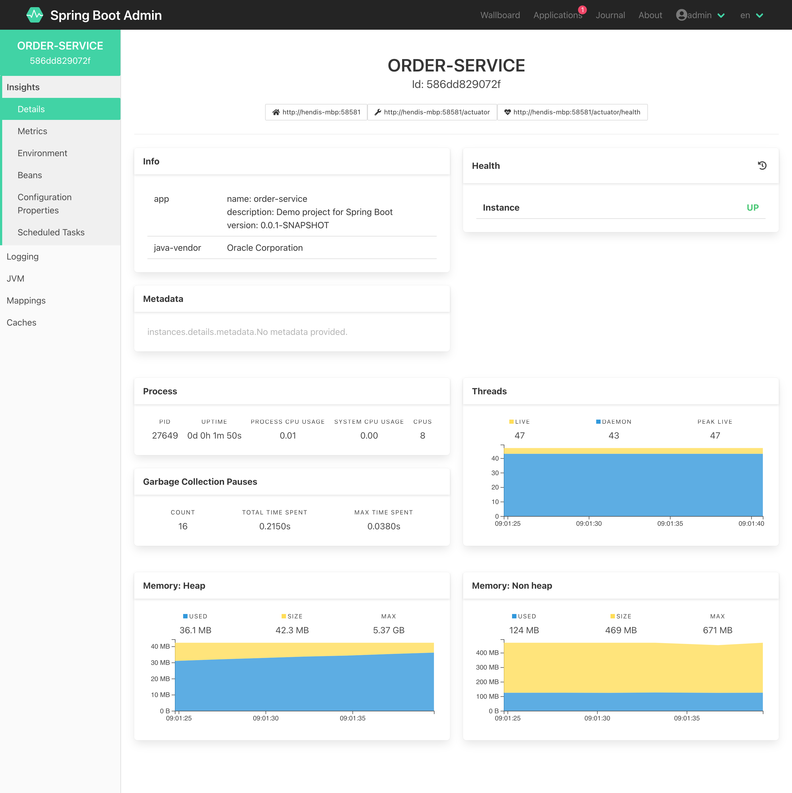

# SpringBootAdminDemo

A Simple Spring Boot Admin Demo Example

### OLD SPRING BOOT ADMIN (1.5.7 version)

Spring Boot Admin Login

Spring Boot Admin Service list

### NEW SPRING BOOT ADMIN (2.4.3 version)

Eureka Server

Spring Boot Admin Login

Spring Boot Admin Service list

Customer Service

Order Service

